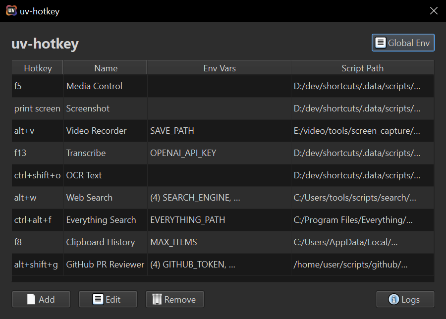

# uv-hotkey

Lightweight UI for hotkey-mapping Python scripts with uv metadata blocks.



```bash
uv run --script uv-hotkey.py
```

## Todo

- [ ] Publish to PyPI (use with uvx)
- [ ] Support scripts from URLs
- [ ] Refactor default scripts (screenshot and transcribe)